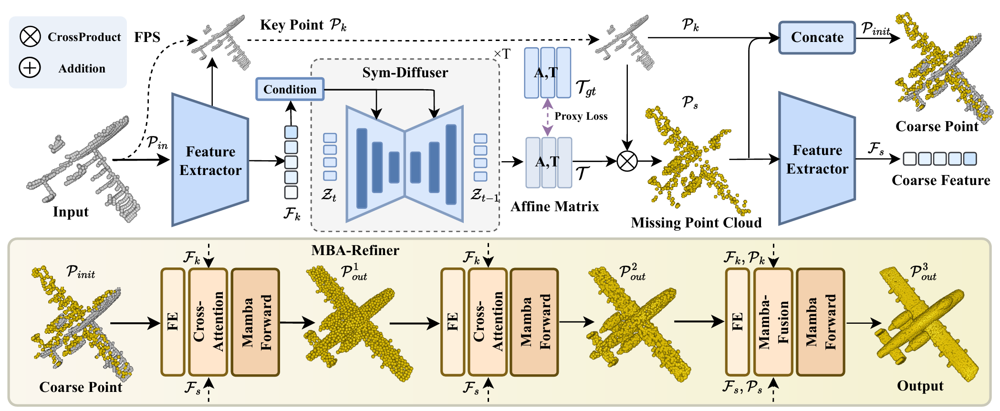

# 🦁 Simba-VLA: Completion-Augmented 3D Diffusion Policy for Occlusion-Robust Vision-Language-Action

<p align="center">
  <a href="#-key-features">Features</a> •
  <a href="#-architecture">Architecture</a> •
  <a href="#-installation">Installation</a> •
  <a href="#-quick-start">Quick Start</a> •
  <a href="#-vla-module-details">VLA Modules</a> •
  <a href="#-experiments">Experiments</a> •
  <a href="#-citation">Citation</a>
</p>

> **TL;DR** — We augment a DP3-style 3D diffusion policy with **Simba geometric completion** to recover occluded 3D states before action generation, achieving robust language-conditioned manipulation and driving under heavy occlusion.

## Abstract

Point-cloud-based Vision-Language-Action (VLA) models suffer significant performance degradation under real-world occlusion and sensor sparsity. We propose **Simba-VLA**, a completion-augmented 3D diffusion VLA pipeline that addresses this by: (1) leveraging a frozen **Simba** model (Mamba + symmetric-aware diffusion) to recover complete 3D geometry from partial observations; (2) encoding both partial and completed point clouds via a **PointNet++ dual-branch encoder** with FiLM text conditioning and cross-attention; (3) generating multi-modal action distributions through a conditional **DDPM action head** with a 1D U-Net denoiser, supporting DDIM accelerated sampling.

The system supports both **robotic manipulation** (7-DoF end-effector control) and **autonomous driving** (command-conditioned waypoint prediction) scenarios, with a comprehensive **occlusion robustness benchmark** featuring 5 simulation modes and severity sweep evaluation.



## 📰 News
- **2026-03** Release of Simba-VLA: Completion-Augmented 3D Diffusion Policy extension.
- **2025-11-22** Initial release of Simba repository and pretrained models.
- **2025-11-08** Simba accepted at **AAAI 2026**.

## 🔑 Key Features

| Category | Highlights |
|----------|-----------|
| **3D Completion** | Frozen Simba (Mamba + Diffusion) restores occluded geometry before policy inference |
| **3D Encoder** | PointNet++ with FPS + Set Abstraction + FiLM language conditioning + Cross-Attention |
| **Action Generation** | Conditional DDPM with 1D U-Net denoiser, cosine noise schedule, DDIM 10-step sampling |
| **Dual-Branch Fusion** | Parallel encoding of partial & completed point clouds for completion-aware decision making |
| **Multi-Scenario** | Manipulation (7-DoF) and Driving (waypoint prediction) via config switching |
| **Occlusion Benchmark** | 5 occlusion modes (viewpoint / planar / random / distance / sector) with severity sweep |
| **Temporal Aggregation** | Transformer-based multi-frame observation fusion with learnable temporal position encoding |
| **Ablation-Ready** | Deterministic MLP action head baseline; single/dual-branch encoder configs |

## 🏗 Architecture

```
                    ┌──────────────────────────────────────────────────────┐
                    │          Simba-VLA: Completion-Augmented             │
                    │            3D Diffusion Policy                       │
                    └────────────────────┬─────────────────────────────────┘
                                         │
          ┌──────────────────────────────┼──────────────────────────────┐
          ▼                              ▼                              ▼
   Partial Point Cloud          Language Instruction            Simba Completion
      (B, N, 3)                       text                       (frozen, Mamba
          │                              │                        + Diffusion)
          │                    ┌─────────┴─────────┐                   │
          │                    ▼                   ▼                   │
          │              ┌──────────┐        ┌──────────┐             │
          │              │ Tokenizer│        │ BiGRU    │             │
          │              └────┬─────┘        │ Encoder  │             │
          │                   └──────┬───────┘          │             │
          │                          │ text_feat        │             │
          │                    ┌─────┴──────┐           │             │
          ▼                    ▼            ▼           │             ▼
  ┌──────────────────┐   ┌──────────────────────┐      │    ┌───────────────┐
  │   PointNet++     │   │   PointNet++         │      │    │  Completed PC │
  │  + FiLM + xAttn  │◄─┤   + FiLM + xAttn     │◄─────┘    │  (B, M, 3)   │
  │  (partial branch)│   │  (completed branch)  │           └───────┬───────┘
  └────────┬─────────┘   └──────────┬───────────┘                   │
           │                        │                                │
           └───────────┬────────────┘                                │
                       ▼                                             │
              ┌─────────────────┐                                    │
              │  Dual-Branch    │                                    │
              │  Fusion (concat)│                                    │
              └────────┬────────┘                                    │
                       ▼                                             │
              ┌─────────────────────┐                                │
              │ ObservationFusion   │                                │
              │ visual + text       │                                │
              │ (+ proprio + temp)  │                                │
              └────────┬────────────┘                                │
                       │                                             │
          ┌────────────┼────────────┐                                │
          ▼            ▼            ▼                                │
   ┌────────────┐ ┌──────────┐ ┌────────────┐                      │
   │ Diffusion  │ │Classifier│ │Deterministic│                      │
   │ Action Head│ │(optional)│ │  (ablation) │                      │
   │ DDPM/DDIM  │ │ softmax  │ │ MLP regress │                      │
   └────────────┘ └──────────┘ └─────────────┘                      │
        │                                                            │
        ▼                                                            ▼
   Action Output                                           Completed Points
  (B, action_dim)                                            (for viz)
```

### Module Overview

| Module | File | Description |
|--------|------|-------------|
| PointNet++ Encoder | `vla/encoder.py` | Hierarchical 3D feature extraction (FPS + Set Abstraction + MaxPool) |
| FiLM + Cross-Attention | `vla/encoder.py` | Text-conditioned 3D feature modulation and fine-grained alignment |
| Dual-Branch Encoder | `vla/encoder.py` | Parallel encoding of partial + completed point clouds |
| Diffusion Action Head | `vla/diffusion_policy.py` | Conditional DDPM with 1D U-Net denoiser, DDIM sampling |
| Deterministic Head | `vla/diffusion_policy.py` | MLP regression baseline for ablation |
| Temporal Aggregation | `vla/temporal.py` | Transformer-based multi-frame fusion + proprioception encoder |
| Occlusion Simulation | `vla/occlusion.py` | 5 occlusion modes with configurable severity |
| Simba Completion | `models/Simba.py` | Mamba + symmetric diffusion point cloud completion (frozen) |
| VLA Model | `vla/model.py` | `CompletionAugmentedDiffusionVLA` — end-to-end integration |
| Tokenizer | `vla/tokenizer.py` | Lightweight regex-based tokenizer |
| Dataset | `vla/dataset.py` | Multi-scenario annotation loader with occlusion augmentation |
| Evaluation | `tools/eval_vla.py` | Occlusion sweep, per-scenario breakdown, ADE/FDE metrics |

## 📂 Pretrained Models

| Model | Dataset | Download |
|:------|:--------|:---------|
| **Simba** (Stage 2) | PCN | [[Google Drive](https://drive.google.com/file/d/1aYHIjgSCJ6aL4-jpi5oyij6Qqvu7mokX/view?usp=sharing)] |

## 🛠 Installation

### Prerequisites
- CUDA 12.1 compatible GPU
- Anaconda or Miniconda
- Python 3.10

### Steps

```bash
# 1. Create environment
conda create --name Simba python=3.10
conda activate Simba

# 2. Install PyTorch
conda install pytorch==2.3.1 torchvision==0.18.1 torchaudio==2.3.1 pytorch-cuda=12.1 -c pytorch -c nvidia

# 3. Install dependencies
pip install -r requirements.txt
pip install --upgrade https://github.com/unlimblue/KNN_CUDA/releases/download/0.2/KNN_CUDA-0.2-py3-none-any.whl

# 4. Install PyTorch3D
conda install https://anaconda.org/pytorch3d/pytorch3d/0.7.8/download/linux-64/pytorch3d-0.7.8-py310_cu121_pyt231.tar.bz2

# 5. Install Mamba & Causal Conv1D (download .whl files first)
# Mamba: https://github.com/state-spaces/mamba/releases?page=2
# Causal Conv1D: https://github.com/Dao-AILab/causal-conv1d/releases?page=2
pip install mamba_ssm-1.2.1+cu122torch2.3cxx11abiFALSE-cp310-cp310-linux_x86_64.whl
pip install causal_conv1d-1.2.1+cu122torch2.3cxx11abiFALSE-cp310-cp310-linux_x86_64.whl

# 6. Compile extensions
bash install.sh
```

## 🚀 Quick Start

### Simba Point Cloud Completion (Backbone)

**Stage 1 — Train SymmGT:**
```bash
CUDA_VISIBLE_DEVICES=0,1 bash ./scripts/dist_train.sh 2 13232 \
    --config ./cfgs/PCN_models/SymmGT.yaml \
    --exp_name SymmGT_stage_1
```

**Stage 2 — Train Simba:**
```bash
CUDA_VISIBLE_DEVICES=0,1 bash ./scripts/dist_train.sh 2 13232 \
    --config ./cfgs/PCN_models/Simba.yaml \
    --exp_name Simba_stage_2
```

Or use the automated two-stage script:
```bash
bash train.sh
```

### VLA Training

```bash
# Manipulation scenario (7-DoF, PointNet++ + Diffusion)
python tools/train_vla.py --config cfgs/VLA_models/SimbaVLA_DP3_manipulation.yaml

# Driving scenario (Waypoint prediction, LiDAR completion)
python tools/train_vla.py --config cfgs/VLA_models/SimbaVLA_DP3_driving.yaml

# Ablation: Deterministic head (no diffusion)
python tools/train_vla.py --config cfgs/VLA_models/SimbaVLA_ablation_deterministic.yaml
```

### VLA Evaluation

```bash
# Standard evaluation
python tools/eval_vla.py \
    --config cfgs/VLA_models/SimbaVLA_DP3_manipulation.yaml \
    --checkpoint experiments/simba_vla_dp3_manipulation/best_model.pth

# Occlusion robustness sweep
python tools/eval_vla.py \
    --config cfgs/VLA_models/SimbaVLA_DP3_manipulation.yaml \
    --checkpoint experiments/simba_vla_dp3_manipulation/best_model.pth \
    --occlusion_sweep --occlusion_method viewpoint \
    --output_json results/occlusion_sweep.json
```

### Inference

```bash
python tools/infer_vla.py \
    --config cfgs/VLA_models/SimbaVLA_DP3_manipulation.yaml \
    --checkpoint experiments/simba_vla_dp3_manipulation/best_model.pth \
    --point_cloud demo/sample.pcd \
    --instruction "pick up the red mug"
```

## 📦 VLA Module Details

### PointNet++ Encoder with FiLM Conditioning

Three-level Set Abstraction with language-conditioned modulation:

```
Input: (B, N, 3)
  └─ SA1: FPS(512) + KNN(32) + MLP[3→64→64→128]     → (B, 512, 128)
      └─ SA2: FPS(128) + KNN(64) + MLP[131→128→128→256] → (B, 128, 256)
          └─ SA3: Global MaxPool + MLP[259→256→512→512]  → (B, 512)
              └─ FiLM: feat × (1 + γ_text) + β_text
              └─ Cross-Attention: Q=3D feat, K/V=text tokens
```

### Diffusion Action Head (DDPM)

- **Forward:** $q(a_t | a_0) = \mathcal{N}(\sqrt{\bar\alpha_t}\, a_0,\; (1-\bar\alpha_t)\, \mathbf{I})$
- **Reverse:** 1D U-Net denoiser predicts noise $\epsilon_\theta(a_t, t, c)$ conditioned on observation features
- **1D U-Net:** `base_dim=128`, `dim_mults=(1,2,4)`, GroupNorm + Mish, time embedding (additive) + condition (FiLM)
- **Schedule:** Cosine (smoother for low-dim action spaces)
- **DDIM:** 10-step accelerated sampling for real-time deployment

### Occlusion Simulation

| Mode | Real-World Analog | Method |
|------|------------------|--------|
| `viewpoint` | Single-view RGBD camera | Keep closest k% from viewpoint |
| `planar` | Wall / table occlusion | Cutting plane removal |
| `random` | Sensor noise / packet loss | Uniform random dropout |
| `distance` | Long-range LiDAR sparsity | Distance-based filtering |
| `sector` | Limited FoV | Angular sector removal |

### Scenario Configs

| Config | Scenario | Action Space | Points | Key Difference |
|--------|----------|-------------|--------|----------------|
| `SimbaVLA_DP3_manipulation.yaml` | Tabletop manipulation | 7-DoF (pos+rot+gripper) | 4096 | PointNet++ + Diffusion |
| `SimbaVLA_DP3_driving.yaml` | Autonomous driving | 4-step 3D waypoints | 8192 | LiDAR completion + trajectory |
| `SimbaVLA_ablation_deterministic.yaml` | Ablation | 7-DoF | 4096 | MLP head, no diffusion |

## 📊 Experiments

### Ablation Matrix

| Experiment | Variable | Purpose |
|-----------|----------|---------|
| Input Ablation | partial / completed / dual-branch | Measure completion contribution |
| Occlusion Sweep | severity ∈ [0, 0.1, ..., 0.8] | Quantify robustness under occlusion |
| Action Head | diffusion vs. deterministic | Validate multi-modal action modeling |
| Encoder | PointNet++ vs. MLP | Impact of hierarchical 3D features |
| Cross-Scenario | manipulation ↔ driving | Generalization assessment |

### Metrics

| Metric | Scenario | Description |
|--------|----------|-------------|
| Accuracy | Both | Discrete action type prediction |
| Action MAE | Manipulation | Mean absolute error of continuous actions |
| ADE | Driving | Average Displacement Error across waypoints |
| FDE | Driving | Final Displacement Error at last waypoint |
| Chamfer Distance | Completion | Simba completion quality |

## 📊 Datasets
Point cloud completion dataset details: [DATASET.md](./DATASET.md).

VLA demo annotations are provided in `demo/` for both manipulation and driving scenarios.

## 🔗 Related Work

| Method | Input | Action Head | 3D Repr. | Completion |
|--------|-------|------------|----------|------------|
| RT-2 (Google, 2023) | RGB + text | VLM tokens | — | — |
| Octo (Berkeley, 2024) | RGB + text | Diffusion | — | — |
| OpenVLA (Stanford, 2024) | RGB + text | LLM tokens | — | — |
| DP3 (Ke et al., RSS 2024) | Point cloud | Diffusion | PointNet++ | — |
| PerAct (Shridhar et al., 2023) | Voxel grid | Discrete | 3D voxel | — |
| 3D-VLA (Zhen et al., 2024) | Multi-view + text | LLM-based | 3D tokens | — |
| **Simba-VLA (Ours)** | **Point cloud + text** | **Diffusion** | **PointNet++** | **✓ Simba** |

## 📜 License
This project is licensed under the MIT License.

## 🙏 Acknowledgements
- [PoinTr](https://github.com/yuxumin/PoinTr) and [SymmCompletion](https://github.com/HKUST-SAIL/SymmCompletion) for point cloud completion foundations.
- [Diffusion Policy](https://diffusion-policy.cs.columbia.edu/) and [DP3](https://3d-diffusion-policy.github.io/) for 3D diffusion policy design.
- [PointNet++](https://github.com/charlesq34/pointnet2) for hierarchical point cloud learning.

## 📖 Citation
```bibtex
@inproceedings{zhang2026simba,
  title={Simba: Towards High-Fidelity and Geometrically-Consistent Point Cloud Completion via Transformation Diffusion},
  author={Lirui Zhang and Zhengkai Zhao and Zhi Zuo and Pan Gao and Jie Qin},
  booktitle={Proceedings of the AAAI Conference on Artificial Intelligence (AAAI)},
  year={2026},
  url={https://arxiv.org/abs/2511.16161},
  note={To appear}
}
```
